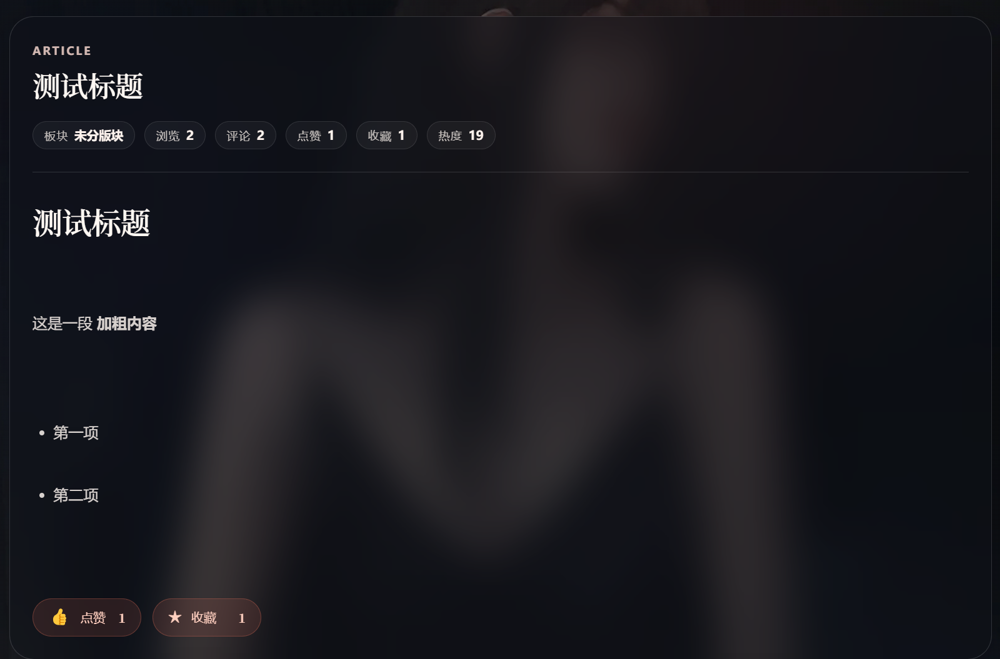
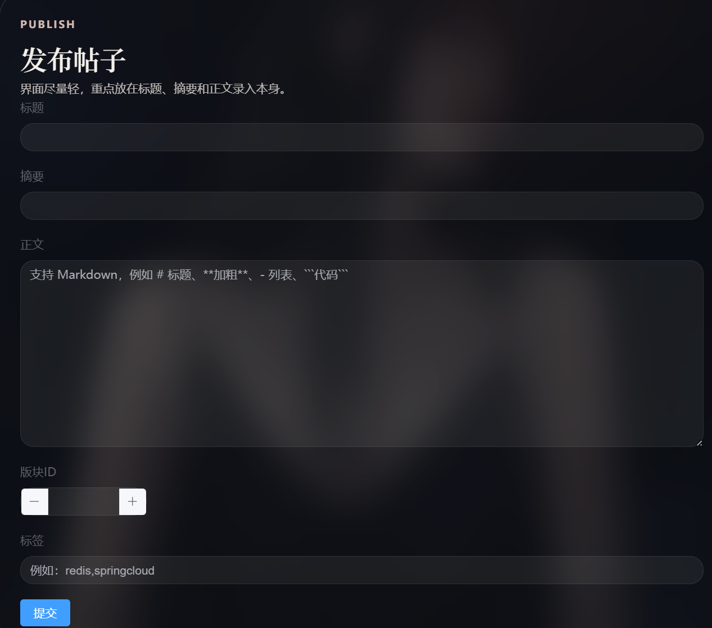

# blog-cloud

基于 Spring Boot 3、Spring Cloud Gateway、Spring Security、JWT、MyBatis、Redis、RabbitMQ、Nacos 构建的个人博客论坛后端项目。

项目采用多模块微服务拆分，围绕用户鉴权、文章发布、评论链路、通知中心、热点数据缓存和网关统一接入进行实现，适合作为 Java 后端 / 微服务方向的练手与展示项目。

## 项目演示：
首页

注册界面

文章详情页

发布页面(支持Markdown)


## 项目特性
- 用户注册、登录、登出、Token 校验与刷新
- 用户资料维护、角色分配、状态管理、活跃度统计
- 文章发布、编辑、删除、详情、普通分页、热榜分页
- 点赞 / 收藏显式幂等接口设计
- 评论创建、删除、分页查询、限流统计
- 通知分页、未读数统计、单条 / 全部已读
- Redis 热点缓存、热榜排序、浏览量 / 点赞 / 收藏计数
- RabbitMQ 异步通知投递
- Spring Cloud Gateway 统一路由与跨域处理
- OpenAPI / Swagger 文档支持

## 技术栈

- Java 17
- Spring Boot 3.2.5
- Spring Cloud 2023.0.1
- Spring Cloud Alibaba 2023.0.1.0
- Spring Security
- JWT
- MyBatis
- MySQL 8
- Redis 7
- RabbitMQ
- Nacos
- Springdoc OpenAPI
- Docker Compose

## 模块说明

- `blog-gateway`
  统一 API 入口，负责路由转发、跨域和公共过滤逻辑。
- `user-service`
  用户注册登录、资料维护、权限控制、角色分配、活跃度统计。
- `article-service`
  文章发布、编辑、删除、详情、热榜、点赞、收藏、板块管理。
- `comment-service`
  评论创建、删除、文章评论分页、评论限流。
- `notify-service`
  通知查询、未读统计、标记已读、删除通知。
- `blog-common`
  通用返回体、工具类、公共组件与共享模型。

## 项目结构

```text
blog-cloud
├─ blog-common
├─ blog-gateway
├─ user-service
├─ article-service
├─ comment-service
├─ notify-service
├─ pressure-test
├─ docker-compose.yml
└─ forum-enhancement.sql
```

## 快速开始

### 1. 环境准备

- JDK 17
- Maven 3.9+
- MySQL 8.x
- Docker / Docker Compose

### 2. 启动基础依赖

```bash
docker compose up -d redis rabbitmq nacos
```

### 3. 初始化数据库

本项目默认使用如下数据库：

- `blog_cloud`
- `blog_cloud_test`

将你的表结构和初始化数据导入对应数据库。仓库中已有 [forum-enhancement.sql](./forum-enhancement.sql) 可作为补充 SQL 使用。

### 4. 修改本地配置

请根据你的本地环境调整各服务 `src/main/resources/application.yml` 中的以下配置：

- MySQL 连接地址、用户名、密码
- Redis 地址
- RabbitMQ 地址与端口
- Nacos 地址
- Feign 服务地址

建议通过环境变量注入敏感配置，至少包括：

- `MYSQL_URL` / `MYSQL_USERNAME` / `MYSQL_PASSWORD`
- `MYSQL_TEST_URL` / `MYSQL_TEST_USERNAME` / `MYSQL_TEST_PASSWORD`
- `REDIS_HOST` / `REDIS_PORT`
- `RABBITMQ_HOST` / `RABBITMQ_PORT` / `RABBITMQ_USERNAME` / `RABBITMQ_PASSWORD`
- `NACOS_SERVER_ADDR`
- `USER_SERVICE_URL` / `ARTICLE_SERVICE_URL`

### 5. 启动服务

按顺序启动：

```bash
mvn -pl blog-common install
mvn -pl user-service spring-boot:run
mvn -pl article-service spring-boot:run
mvn -pl comment-service spring-boot:run
mvn -pl notify-service spring-boot:run
mvn -pl blog-gateway spring-boot:run
```

## 网关路由

所有外部请求默认通过网关进入：

- `/api/user/**` -> `user-service`
- `/api/article/**` -> `article-service`
- `/api/comment/**` -> `comment-service`
- `/api/notify/**` -> `notify-service`

## 接口示例

### 用户模块

- `POST /api/user/user/register`
- `POST /api/user/user/login`
- `GET /api/user/user/me`
- `PUT /api/user/user/password`
- `POST /api/user/user/token/refresh`

### 文章模块

- `POST /api/article/article/publish`
- `GET /api/article/article/detail/{id}`
- `GET /api/article/article/page/normal`
- `GET /api/article/article/page/hot`
- `PUT /api/article/article/like/{articleId}`
- `PUT /api/article/article/favorite/{articleId}`

### 评论模块

- `POST /api/comment/comment`
- `GET /api/comment/comment/article/{articleId}`
- `POST /api/comment/comment/page`
- `DELETE /api/comment/comment/{id}`

### 通知模块

- `POST /api/notify/notify/page`
- `GET /api/notify/notify/{id}`
- `GET /api/notify/notify/unread/count`
- `PUT /api/notify/notify/read/{id}`

## 后续优化方向

- 补充系统架构图、时序图和接口示例

## License

本项目采用 `MIT` License，详见 [LICENSE](./LICENSE)。
