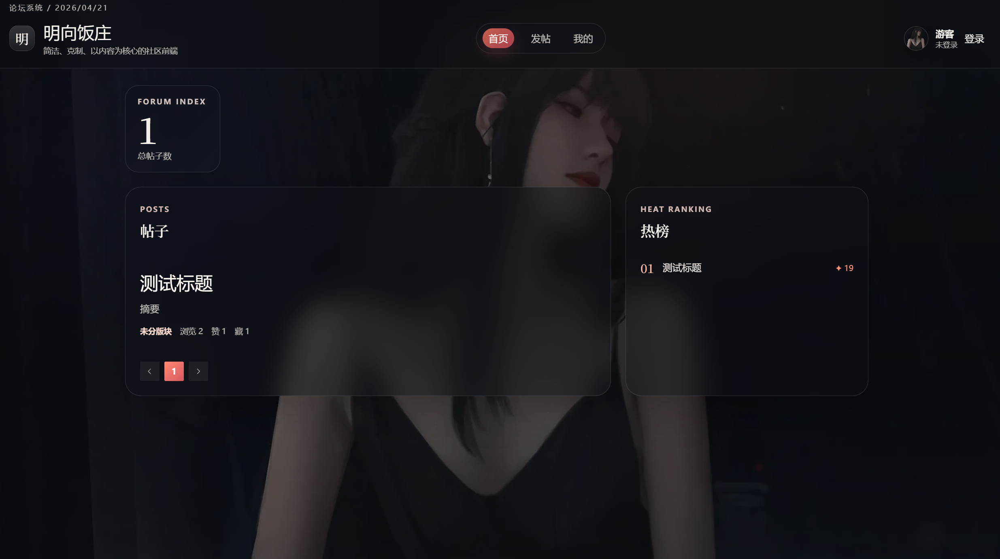
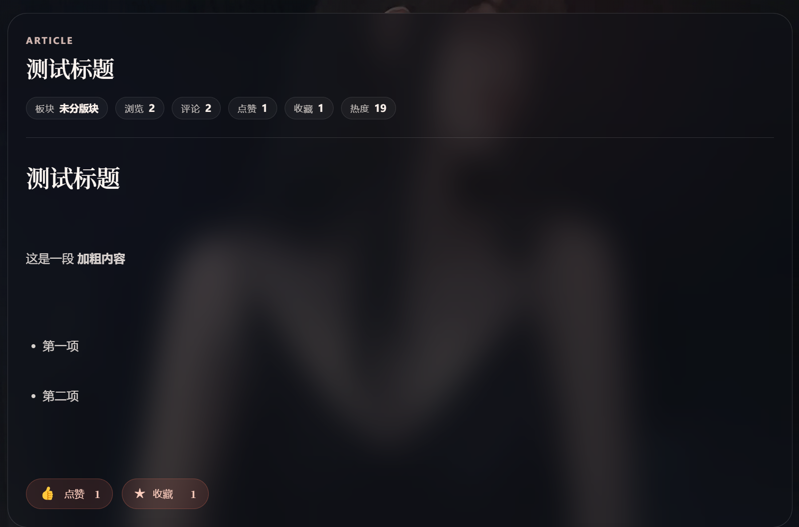
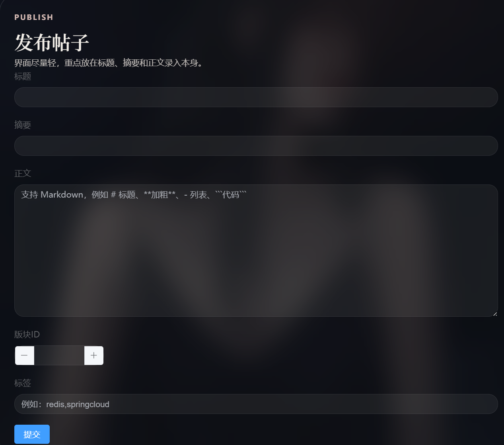

# blog-cloud

基于 Spring Boot 3、Spring Cloud构建的论坛。

项目采用多模块微服务拆分，围绕用户鉴权、文章发布、评论链路、通知中心、热点数据缓存和网关统一接入进行实现。

## 项目演示：
首页

注册界面

文章详情页

发布页面(支持Markdown)


## 模块说明

- `blog-gateway`
  统一 API 入口，负责路由转发、跨域和公共过滤逻辑。
- `user-service`
  用户注册登录、资料维护、权限控制、角色分配、活跃度统计。
- `article-service`
  文章发布、编辑、删除、详情、热榜、点赞、收藏、板块管理。
- `comment-service`
  评论创建、删除、文章评论分页、评论限流。
- `notify-service`
  通知查询、未读统计、标记已读、删除通知。
- `blog-common`
  通用返回体、工具类、公共组件与共享模型。

## 项目结构

```text
blog-cloud
├─ blog-common
├─ blog-gateway
├─ user-service
├─ article-service
├─ comment-service
├─ notify-service
```

### 修改本地配置
- MySQL 连接地址、用户名、密码
- Redis 地址
- RabbitMQ 地址与端口
- Nacos 地址
- Feign 服务地址

## License

本项目采用 `MIT` License，详见 [LICENSE](./LICENSE)。
