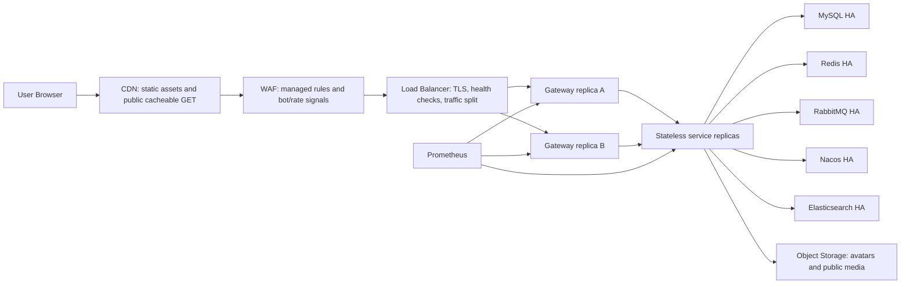

# Production Topology

This repository's Docker Compose stack is a local baseline, not the final production topology.

## Recommended Request Path

## Current Local Ports

- `blog-web`: host `${WEB_PUBLIC_PORT:-80}` to container `80`; current local `.env` uses `18081`.
- `blog-gateway`: host `${GATEWAY_PUBLIC_PORT:-18080}` to container `18080`.
- `https-proxy`: profile `https`, host `${HTTP_PROXY_PORT:-18082}` and `${HTTPS_PUBLIC_PORT:-443}`.
- `prometheus`: host `${PROMETHEUS_PORT:-9090}`.
- `grafana`: host `${GRAFANA_PORT:-3000}`.
- `nacos`: host `${NACOS_PUBLIC_PORT:-8848}`.
- `rabbitmq` management: host `${RABBITMQ_MANAGEMENT_PORT:-15672}`.
- `elasticsearch`: host `${ELASTICSEARCH_PORT:-9200}`.
- `mysql`: host `${MYSQL_HOST_PORT:-3306}`; current local `.env` uses `13306`.

## Health Checks

- ALB checks Gateway `/actuator/health`.
- Prometheus scrapes `/actuator/prometheus` on Gateway and service replicas from the private network.
- Public internet should not reach service containers, Nacos, MySQL, Redis, RabbitMQ, Elasticsearch, Prometheus, or Grafana directly.
