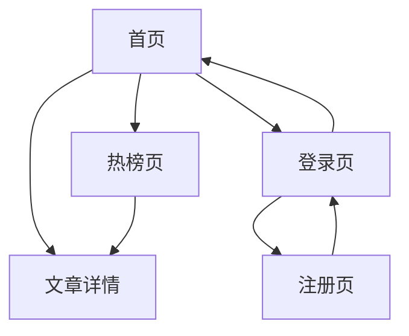
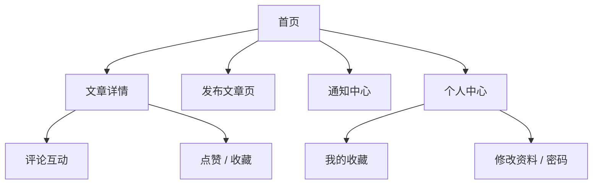
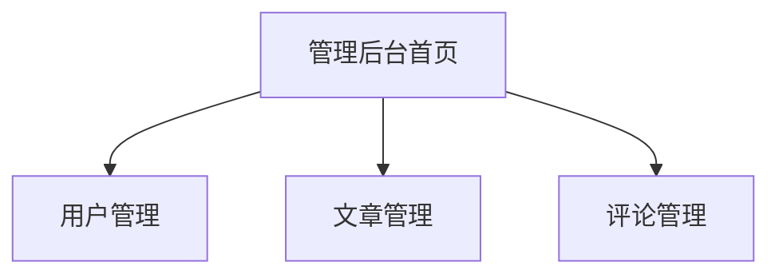

# 前端页面清单与页面流转图

## 1. 文档目标

这份文档用于把“上线版功能清单”继续往前推进一层，明确：

1. 一期上线最少需要哪些页面。
2. 每个页面给谁用。
3. 页面之间怎么跳转。
4. 每个页面依赖哪些后端接口。
5. 前端开发应该按什么顺序做。

这份文档写完以后，前端开发就可以从“需求层”进入“页面层”。

---

## 2. 一期前端建设目标

当前项目后端能力已经比较完整，但还没有独立前端工程。

所以一期前端目标不是做复杂社区产品，而是做一个：

`能完整演示、能联调、能上线的最小前端界面`

前端的核心要求是：

- 页面清晰
- 交互完整
- 接口打通
- 权限明确
- 游客 / 用户 / 管理员的页面视图有区分

---

## 3. 页面角色划分

前端页面按照使用角色分成三类：

## 3.1 游客可访问页面

- 首页文章列表页
- 热榜页
- 文章详情页
- 登录页
- 注册页

## 3.2 登录用户可访问页面

- 发布文章页
- 编辑文章页
- 我的收藏页
- 通知中心页
- 个人中心页

## 3.3 管理员可访问页面

- 管理后台首页
- 用户管理页
- 文章管理页
- 评论管理页

---

## 4. 一期页面总清单

## 4.1 公共页面

### 页面 1：首页文章列表页

页面作用：

- 展示普通文章分页列表

主要内容：

- 顶部导航
- 搜索框占位
- 文章卡片列表
- 分页器
- 登录/注册入口
- 热榜入口

接口依赖：

- `GET /api/article/article/page/normal`
- 登录态下可补充用户信息接口

### 页面 2：热榜页

页面作用：

- 展示高热度文章列表

主要内容：

- 热榜文章列表
- 热度展示
- 分页器

接口依赖：

- `GET /api/article/article/page/hot`

### 页面 3：文章详情页

页面作用：

- 展示文章全文和评论互动

主要内容：

- 文章标题
- 作者信息
- 正文内容
- 浏览数、点赞数、收藏数
- 点赞按钮
- 收藏按钮
- 评论区

接口依赖：

- `GET /api/article/article/detail/{id}`
- `GET /api/article/article/likes/{articleId}`
- `GET /api/article/article/favorites/count/{articleId}`
- `GET /api/article/article/views/{articleId}`
- `GET /api/comment/comment/article/{articleId}`

### 页面 4：登录页

页面作用：

- 用户登录

主要内容：

- 用户名输入框
- 密码输入框
- 登录按钮
- 去注册入口

接口依赖：

- `POST /api/user/user/login`

### 页面 5：注册页

页面作用：

- 新用户注册

主要内容：

- 用户名
- 密码
- 确认密码
- 注册按钮

接口依赖：

- `POST /api/user/user/register`

---

## 4.2 登录用户页面

### 页面 6：发布文章页

页面作用：

- 登录用户发布文章

主要内容：

- 标题输入框
- 摘要输入框
- 正文编辑区
- 标签输入
- 发布按钮

接口依赖：

- `POST /api/article/article/publish`
- 可选补充板块列表接口

### 页面 7：编辑文章页

页面作用：

- 编辑自己发布的文章

主要内容：

- 文章内容回显
- 编辑提交按钮

接口依赖：

- `GET /api/article/article/detail/{id}`
- `PUT /api/article/article/{id}`

### 页面 8：我的收藏页

页面作用：

- 查看当前用户收藏的文章

主要内容：

- 收藏文章列表
- 取消收藏按钮

接口依赖：

- `GET /api/article/article/favorite/page`
- `DELETE /api/article/article/favorite/{articleId}`

### 页面 9：通知中心页

页面作用：

- 查看通知、未读数、标记已读

主要内容：

- 未读数角标
- 通知列表
- 已读按钮
- 全部已读按钮

接口依赖：

- `POST /api/notify/notify/page`
- `GET /api/notify/notify/unread/count`
- `PUT /api/notify/notify/read/{id}`
- `PUT /api/notify/notify/read/all`

### 页面 10：个人中心页

页面作用：

- 查看和修改个人资料

主要内容：

- 用户信息展示
- 编辑资料表单
- 修改密码入口
- 退出登录按钮

接口依赖：

- `GET /api/user/user/me`
- `PUT /api/user/user/info`
- `PUT /api/user/user/password`
- `POST /api/user/user/logout`

---

## 4.3 管理员页面

### 页面 11：管理后台首页

页面作用：

- 管理端统一入口

主要内容：

- 左侧菜单
- 用户管理入口
- 文章管理入口
- 评论管理入口

接口依赖：

- 可先使用现有统计接口或占位展示

### 页面 12：用户管理页

页面作用：

- 管理用户状态、角色

主要内容：

- 用户列表
- 用户状态修改
- 角色分配

接口依赖：

- 用户管理相关接口

### 页面 13：文章管理页

页面作用：

- 管理员删除违规文章

主要内容：

- 文章列表
- 删除按钮

接口依赖：

- 文章分页接口
- 管理员删除文章接口

### 页面 14：评论管理页

页面作用：

- 管理员删除违规评论

主要内容：

- 评论列表
- 删除按钮

接口依赖：

- 评论分页接口
- 管理员删除评论接口

---

## 5. 页面流转关系

## 5.1 游客主路径

游客最主要的路径是：

- 首页浏览内容
- 进入详情页
- 被引导登录或注册

## 5.2 登录用户主路径

登录用户最核心路径是：

- 登录后浏览文章
- 发布文章
- 评论互动
- 收通知
- 管理个人资料

## 5.3 管理员主路径

管理员路径不需要复杂，重点是“基础管理能完成”。

---

## 6. 页面和接口映射关系

## 6.1 首页

依赖接口：

- 普通文章分页

接口作用：

- 展示主内容流

## 6.2 热榜页

依赖接口：

- 热榜分页

接口作用：

- 展示高热度内容

## 6.3 文章详情页

依赖接口：

- 文章详情
- 评论列表
- 点赞数
- 收藏数
- 浏览数
- 点赞/收藏动作
- 评论提交

接口作用：

- 形成文章阅读和互动闭环

## 6.4 登录/注册页

依赖接口：

- 登录接口
- 注册接口

接口作用：

- 获取用户身份

## 6.5 个人中心

依赖接口：

- 当前用户信息
- 修改资料
- 修改密码
- 退出登录

接口作用：

- 维持账户体系

## 6.6 通知中心

依赖接口：

- 通知分页
- 未读数
- 单条已读
- 全部已读

接口作用：

- 完成互动反馈闭环

---

## 7. 一期前端页面开发顺序

不要并行乱做，建议按依赖顺序来。

## 第一阶段：基础框架搭建

- 前端工程初始化
- 路由
- 登录态管理
- 请求封装
- 全局布局

## 第二阶段：游客页

- 登录页
- 注册页
- 首页
- 热榜页
- 文章详情页

原因：

- 这些页面依赖最少
- 可以最快形成展示效果

## 第三阶段：登录用户页

- 发布文章页
- 编辑文章页
- 我的收藏页
- 通知中心页
- 个人中心页

## 第四阶段：管理页

- 管理后台首页
- 用户管理页
- 文章管理页
- 评论管理页

---

## 8. 页面最小 UI 建议

现阶段目标是上线，不是做极复杂视觉设计。

建议风格：

- 前台页面：简洁内容型风格
- 管理后台：标准台账型风格

技术建议：

- `Vue3`
- `Vue Router`
- `Pinia`
- `Axios`
- `Element Plus`

这样做的原因是：

- 组件成熟
- 登录表单、表格、分页、抽屉、弹窗都能快速搭建
- 很适合个人项目快速完成上线版

---

## 9. 页面验收标准

页面不是“能打开就算完成”，每个页面必须满足：

1. 页面可访问
2. 数据能正确展示
3. 权限正确
4. 操作后有明确反馈
5. 异常状态可处理

例如文章详情页的验收标准：

- 打开页面能看到文章
- 评论列表能正常展示
- 未登录时只能浏览，不能评论
- 登录后可评论、点赞、收藏
- 接口失败时页面有提示

---

## 10. 当前项目进度对应的页面状态判断

从当前后端情况看：

- 首页接口：基本具备
- 热榜接口：具备
- 文章详情接口：具备
- 评论接口：具备
- 通知接口：具备
- 登录注册接口：具备
- 收藏接口：具备
- 基础管理接口：部分具备，后续可能还要补页面适配接口

所以页面开发已经具备条件。

换句话说：

`现在可以正式开始前端工程开发了`

---

## 11. 下一步建议

现在最合理的下一步是再补一份文档：

- `18_接口联调清单.md`

这份文档会把：

- 每个页面要调哪些接口
- 每个接口的请求方式、参数、登录要求
- 前端联调顺序
- 联调中的注意事项

全部整理出来。

然后就能正式进入前端编码阶段。

