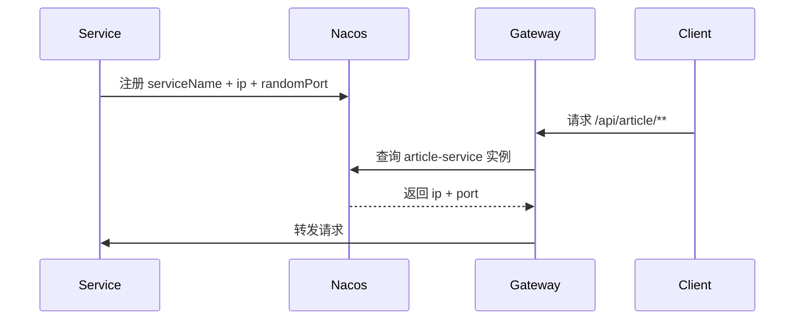

# 自动端口与网关识别说明

## 1. 你现在的问题是什么

你之前每个微服务都写死了端口：

- `user-service = 9011`
- `article-service = 9020`
- `comment-service = 9003`
- `notify-service = 9004`

这样本地开发有两个问题：

1. 一个端口被占用就启动失败。
2. 每次改端口，网关和调用方都要跟着改。

这不是微服务推荐的方式。

---

## 2. 正确做法是什么

正确做法是：

1. 微服务随机分配一个未被占用的端口启动。
2. 服务启动后把 `ip + port + serviceName` 注册到 `Nacos`。
3. 网关不再关心具体端口，只按服务名转发。
4. 网关通过 `lb://service-name` 找到 Nacos 里的可用实例。

也就是说：

- 微服务负责“自己启动并注册”
- Nacos 负责“记录这个服务现在在哪个端口”
- Gateway 负责“按服务名找到实例并转发”

---

## 3. 这次我做了什么改动

### 3.1 业务服务端口改为自动选择

已经把下面 4 个服务改成了：

```yml
server:
  port: ${SERVER_PORT:0}
```

含义是：

- 如果你显式传了 `SERVER_PORT`，就用你指定的端口
- 如果你没传，就使用 `0`
- `0` 的含义就是“让操作系统自动分配一个可用端口”

对应文件：

- [user-service application.yml](/F:/test_file/blog-cloud/user-service/src/main/resources/application.yml)
- [article-service application.yml](/F:/test_file/blog-cloud/article-service/src/main/resources/application.yml)
- [comment-service application.yml](/F:/test_file/blog-cloud/comment-service/src/main/resources/application.yml)
- [notify-service application.yml](/F:/test_file/blog-cloud/notify-service/src/main/resources/application.yml)

### 3.2 网关默认按服务名转发

我把网关默认路由改成了：

- `lb://user-service`
- `lb://article-service`
- `lb://comment-service`
- `lb://notify-service`

对应文件：

- [blog-gateway application.yml](/F:/test_file/blog-cloud/blog-gateway/src/main/resources/application.yml)

这意味着：

- 网关不再依赖固定端口
- 只要服务注册到了 Nacos
- Gateway 就能自动找到当前实例

### 3.3 网关端口保持固定

网关仍然建议固定一个端口，比如：

```yml
server:
  port: ${SERVER_PORT:8080}
```

因为：

- 前端只需要记住网关地址
- 外部访问入口最好稳定

---

## 4. 这样以后怎么启动

## 4.1 先启动中间件

你已经说了中间件都在 Docker 里，所以先保证：

- MySQL
- Redis
- RabbitMQ
- Nacos

正常运行。

## 4.2 再启动微服务

在 IDEA 中直接启动：

- `UserServiceApplication`
- `ArticleServiceApplication`
- `CommentServiceApplication`
- `NotifyServiceApplication`

它们会：

- 自动挑选空闲端口
- 自动注册到 Nacos

## 4.3 最后启动网关

启动：

- `BlogGatewayApplication`

网关固定在 `8080`，然后通过：

- `lb://user-service`
- `lb://article-service`
- `lb://comment-service`
- `lb://notify-service`

去找 Nacos 里的实例。

---

## 5. 你如何知道服务被分到了哪个端口

启动成功后有 3 种方式可以看：

### 方式 1：IDEA 控制台日志

Spring Boot 启动时会打印：

```text
Tomcat started on port 54321
```

### 方式 2：Nacos 控制台

打开：

- `http://localhost:8848/nacos`

你会看到每个服务注册后的实例信息，包括：

- 服务名
- IP
- 端口
- 健康状态

### 方式 3：本机端口查看

Windows 下可以看监听端口。

---

## 6. 为什么网关能识别到“哪个端口对应哪个服务”

因为网关不是自己猜端口，而是去问 Nacos。

流程是：



所以关键点不是“网关记住了端口”，而是：

`Nacos 保存了服务实例列表，Gateway 每次按服务名去发现实例`

---

## 7. 这种方式的好处

### 好处 1：不怕端口冲突

服务自己选空闲端口，不需要一个一个试。

### 好处 2：更符合微服务

微服务本来就不应该依赖写死端口。

### 好处 3：后面扩容更方便

如果以后你起两个 `article-service` 实例：

- 一个 `51231`
- 一个 `51232`

它们都会注册到 Nacos。

Gateway 仍然只需要：

- `lb://article-service`

不需要改任何业务路由。

### 好处 4：本地开发体验更好

IDEA 里多次运行某个服务，也不容易因为端口冲突失败。

---

## 8. 注意事项

### 注意 1：必须依赖 Nacos

如果你要自动端口 + 网关自动识别，就必须确保：

- 服务注册到了 Nacos
- Gateway 走的是 `lb://`

如果没有注册中心，这套机制就不成立。

### 注意 2：不要再让 Feign 写死 URL

服务间调用应该优先按服务名。

你现在 `comment-service` 的 Feign 已经往这个方向改了。

### 注意 3：网关端口不要也随机

业务服务随机没问题，但：

- 网关建议固定端口
- 否则前端每次都不知道该访问哪

所以推荐：

- 业务服务自动端口
- 网关固定 `8080`

---

## 9. 现在你应该怎么做

现在在 IDEA 里这样做：

1. 启动 `Nacos`
2. 启动 `UserServiceApplication`
3. 启动 `ArticleServiceApplication`
4. 启动 `CommentServiceApplication`
5. 启动 `NotifyServiceApplication`
6. 打开 Nacos 控制台确认服务实例
7. 启动 `BlogGatewayApplication`
8. 统一从 `http://localhost:8080` 访问

这样以后你就不需要再手动挑业务服务端口了。

