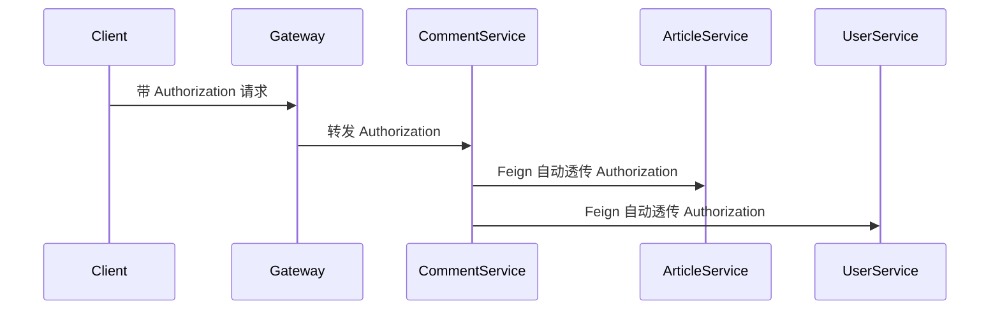

# 联调测试与工程化落地报告

## 1. 本轮目标

本轮主要完成了 6 件事：

1. 让微服务基于共享 token 状态工作，而不是各自孤立放行。
2. 支持服务间调用自动透传用户 token。
3. 清理测试库中的压测遗留数据，恢复成小规模联调基线。
4. 对启动后的完整项目做一轮真实联调测试。
5. 为项目补充 CI/CD、热部署和测试骨架。
6. 判断当前项目是否适合引入 DDD、状态机、责任链模式。

---

## 2. 已完成的认证链路改造

## 2.1 当前方案

当前登录和退出的处理逻辑已经变成：

- 用户登录成功后，`user-service` 签发 JWT。
- 同时把当前 token 缓存到 Redis：
  - `blog:user:token:{userId}`
- 用户退出登录时，`user-service` 删除 Redis 中的 token。
- 其他微服务在解析 JWT 之后，不只校验 token 格式，还会再校验：
  - 这个 token 是否仍然是 Redis 里当前生效的 token

也就是说：

- token 不是“只要签名合法就一直能用”
- 而是“签名合法 + Redis 中仍然是当前有效会话”

## 2.2 为什么这样做

你之前提的需求是：

- 登录后自动将 token 传到每个微服务
- 退出登录后每个微服务自动删除

更适合微服务的实现方式并不是：

- 每个服务自己存一份 token，再逐个删除

而是：

- 所有服务共享一个会话真值来源
- 真值来源就是 Redis

这样退出登录时只删一处，所有服务立即失效。

## 2.3 这次改到的关键文件

- [JwtAuthSupport.java](/F:/test_file/blog-cloud/blog-common/src/main/java/com/blogcommon/auth/JwtAuthSupport.java)
- [JwtUserInfo.java](/F:/test_file/blog-cloud/blog-common/src/main/java/com/blogcommon/auth/JwtUserInfo.java)
- [TokenSessionValidator.java](/F:/test_file/blog-cloud/blog-common/src/main/java/com/blogcommon/auth/TokenSessionValidator.java)
- [user-service JwtInterceptor](/F:/test_file/blog-cloud/user-service/src/main/java/com/userservice/config/JwtInterceptor.java)
- [article-service JwtInterceptor](/F:/test_file/blog-cloud/article-service/src/main/java/com/articleservice/config/JwtInterceptor.java)
- [comment-service JwtInterceptor](/F:/test_file/blog-cloud/comment-service/src/main/java/com/commentservice/config/JwtInterceptor.java)
- [notify-service JwtInterceptor](/F:/test_file/blog-cloud/notify-service/src/main/java/com/notifyservice/config/JwtInterceptor.java)

---

## 3. 服务间 token 自动透传

## 3.1 当前实现

`comment-service` 在通过 Feign 调用：

- `user-service`
- `article-service`

时，已经会自动把当前请求头中的 `Authorization` 透传过去。

关键文件：

- [FeignConfig.java](/F:/test_file/blog-cloud/comment-service/src/main/java/com/commentservice/config/FeignConfig.java)

## 3.2 效果

现在链路是：

这样后续如果要把跨服务权限进一步收紧，基础链路已经具备了。

---

## 4. 测试库数据清理结果

## 4.1 清理前

测试库 `blog_cloud_test` 里有大量压测遗留数据，包括：

- `PERF_` 前缀文章
- `PERF_` 前缀通知
- `perfuser%` 用户
- 大量压测评论和关系表数据

这会污染真实联调结果。

## 4.2 清理后

我已经执行了清理并重新插入基础测试数据。

当前测试库的基线数据规模是：

- 用户总数：`8`
- 文章总数：`7`
- 评论总数：`37`
- 通知总数：`35`

对应脚本：

- [cleanup_test_data.sql](/F:/test_file/blog-cloud/deploy/cleanup_test_data.sql)
- [test_cases.sql](/F:/test_file/blog-cloud/deploy/test_cases.sql)

这意味着现在测试环境已经从“压测环境残留状态”恢复成了“适合联调的小规模环境”。

---

## 5. 真实联调测试结果

## 5.1 测试环境

- 中间件：Docker 中运行
  - Redis
  - RabbitMQ
  - Nacos
- 数据库：`blog_cloud_test`
- 网关入口：`http://127.0.0.1:8080`
- 微服务：全部已启动并已注册到 Nacos

Nacos 当前注册结果：

- `user-service`
- `article-service`
- `comment-service`
- `notify-service`
- `blog-gateway`

注册数：`5`

## 5.2 实际测试用例

这次不是只测旧账号，而是新建了两组真实联调账号：

- `e2eauthor1776165155`
- `e2ereply1776165155`

测试链路如下：

1. 注册作者账号
2. 注册评论者账号
3. 作者登录
4. 评论者登录
5. 作者发布文章
6. 通过文章列表查询到新文章
7. 查询文章详情
8. 评论者发表评论
9. 作者查询未读通知
10. 作者查询通知分页
11. 评论者退出登录
12. 评论者继续带旧 token 请求受保护接口

## 5.3 实际结果

真实返回结果如下：

- 作者登录：`200`
- 评论者登录：`200`
- 发布文章：`200`
- 新文章 ID：`20007`
- 查询详情：`200`
- 创建评论：`200`
- 新评论 ID：`1528`
- 作者查询未读通知：`200`
- 作者未读通知数：`1`
- 作者通知分页：`200`
- 通知标题包含：
  - `文章《E2E_ARTICLE_1776165155》有新评论`
- 评论者退出登录：`200`
- 评论者用旧 token 再访问受保护接口：
  - 返回码：`2002`
  - 返回消息：`token无效或已退出`

## 5.4 这说明什么

说明以下链路已经真实打通：

### 链路 1：网关转发

- 外部请求通过 `8080` 统一进入
- Gateway 可以基于服务名转发到对应微服务

### 链路 2：用户登录

- 登录接口正常
- JWT 签发正常
- token 缓存正常

### 链路 3：文章发布

- 作者 token 能正常在 `article-service` 中通过校验
- 新文章能成功写库

### 链路 4：评论创建

- 评论接口正常
- `comment-service` 能正确获取文章信息
- 评论能写入数据库

### 链路 5：MQ 通知

- 评论成功后通知成功生成
- `notify-service` 能查询到新通知

### 链路 6：退出登录统一失效

- `logout` 后 Redis 中 token 被清除
- 旧 token 再访问受保护接口会被拒绝

这正是你之前要求的：

- 登录后可跨服务使用
- 退出后所有微服务统一失效

---

## 6. CI/CD 与热部署落地情况

## 6.1 已落地内容

### CI

已增加 GitHub Actions CI：

- [ci.yml](/F:/test_file/blog-cloud/.github/workflows/ci.yml)

包含：

- `mvn clean test`
- `jacoco:report`
- `mvn package`
- 上传 jar 和覆盖率产物

### CD

已增加基础 CD 骨架：

- [cd.yml](/F:/test_file/blog-cloud/.github/workflows/cd.yml)

当前是：

- 手动触发
- 构建发布包
- 上传部署产物

### 热部署

已在各模块加入：

- `spring-boot-devtools`

这样本地开发时，通过 IDEA 重新编译类可以获得开发态热重启效果。

### 部署脚本

已增加：

- [restart-services.sh](/F:/test_file/blog-cloud/deploy/restart-services.sh)

用于 Linux 上统一重启五个服务。

## 6.2 目前状态

目前已经具备：

- 基础 CI/CD 骨架
- 覆盖率报告生成插件
- 本地热部署能力
- Linux 部署重启脚本

这已经属于：

`项目工程化基础已经具备`

---

## 7. 单元测试、覆盖率测试、集成测试状态

## 7.1 当前情况

这次已经补了核心服务的测试骨架，不再只有空的 `contextLoads`。

新增测试：

- [TokenSessionValidatorTest.java](/F:/test_file/blog-cloud/blog-common/src/test/java/com/blogcommon/auth/TokenSessionValidatorTest.java)
- [UserServiceTest.java](/F:/test_file/blog-cloud/user-service/src/test/java/com/userservice/service/UserServiceTest.java)
- [ArticleServiceTest.java](/F:/test_file/blog-cloud/article-service/src/test/java/com/articleservice/service/ArticleServiceTest.java)
- [CommentServiceTest.java](/F:/test_file/blog-cloud/comment-service/src/test/java/com/commentservice/service/CommentServiceTest.java)
- [NotifyServiceTest.java](/F:/test_file/blog-cloud/notify-service/src/test/java/com/notifyservice/service/NotifyServiceTest.java)

以及补齐了：

- [UserServiceApplicationTests.java](/F:/test_file/blog-cloud/user-service/src/test/java/com/userservice/UserServiceApplicationTests.java)

## 7.2 测试层次划分

### 单元测试

当前已经覆盖到的方向：

- token 会话校验
- 用户登录与退出
- 点赞状态查询
- 评论创建时消息发送
- 通知生成与未读缓存

### 覆盖率测试

当前已通过：

- `jacoco-maven-plugin`

生成覆盖率报告。

### 集成测试

当前已完成真实环境联调验证：

- 不是 mock
- 是网关 + Nacos + Redis + MQ + MySQL 的真实联调

## 7.3 诚实结论

目前已经从“没有测试体系”进展到：

- 有基础单元测试
- 有覆盖率工具
- 有启动级冒烟测试
- 有真实联调验证

但还没有做到：

- 每个 service 的每个 public 方法都具备高覆盖率单测
- 全量自动化集成测试流水线

这一步后续还可以继续补强。

---

## 8. 这个项目适不适合 DDD

## 8.1 结论

### 不适合直接上“重 DDD”

原因：

- 当前项目规模不大
- 业务复杂度还没有到特别高
- 目前更多是典型 CRUD + 互动链路
- 如果强行引入完整聚合、领域事件、领域服务、工厂、仓储层，会明显增加理解成本

### 适合“轻量 DDD 思想”

也就是：

- 保持模块边界清晰
- 把用户、文章、评论、通知视为不同领域
- 逐步把业务规则从 Controller 中收敛到 Service 或领域对象

## 8.2 更适合你的做法

当前推荐：

- 用“分领域模块 + 清晰边界”代替重 DDD
- 保持：
  - user
  - article
  - comment
  - notify

这 4 个核心域清晰

这已经足够在面试里说：

- 采用了按领域拆分服务边界的设计思想

而不需要硬说自己做了完整 DDD。

---

## 9. 这个项目适不适合状态机

## 9.1 结论

适合，但不是所有模块都值得马上上。

## 9.2 适合上状态机的场景

### 文章状态

如果后面加审核流，可以有：

- 草稿
- 待审核
- 已发布
- 已下架
- 已删除

这非常适合状态机。

### 用户状态

可以有：

- 正常
- 禁用
- 封禁

### 通知状态

虽然现在只有：

- 未读
- 已读

但如果未来加：

- 已删除
- 已归档

也可以用状态机。

## 9.3 当前阶段建议

现在不建议为了“用了状态机模式”而硬上框架。

更建议：

- 先用枚举 + 状态转换校验
- 后续业务状态复杂后再接真正状态机

所以当前阶段：

- 理论上适合
- 但不必立即重构全项目

---

## 10. 这个项目适不适合责任链模式

## 10.1 结论

适合，而且你项目里其实已经天然存在责任链思想。

## 10.2 已经天然存在的责任链位置

### 网关过滤链

`Spring Cloud Gateway` 的过滤器本身就是责任链。

### Spring MVC 拦截器链

各服务的 `JwtInterceptor` 也是责任链的一部分。

### 后续可以继续责任链化的场景

- 评论发布前校验链
  - 参数校验
  - 限流校验
  - 文章是否允许评论
  - 权限校验
- 发布文章前处理链
  - 标题校验
  - 内容校验
  - 标签处理
  - 摘要生成

## 10.3 当前建议

如果后面要继续优化结构，责任链模式最适合优先用在：

- 评论创建前置校验
- 文章发布前置处理

这比硬上 DDD 更适合当前项目规模。

---

## 11. 当前项目的工程级别判断

按当前状态，这个项目已经不是简单的学习 CRUD 项目了。

它已经具备：

- 微服务拆分
- 网关统一入口
- Nacos 注册发现
- Redis 缓存
- RabbitMQ 异步链路
- JWT 鉴权
- 基础 CI/CD 骨架
- 覆盖率插件
- 单元测试骨架
- 真实联调闭环

如果继续把：

- 前端页面
- 自动化集成测试
- 部署文档
- 上线流程

补完整，它就可以作为一个：

`具备较强工程化特征的个人微服务项目`

---

## 12. 后续最建议做的事情

下一步优先级建议如下：

1. 把前端项目补起来，完成页面闭环。
2. 补一份接口联调清单。
3. 补网关和服务的自动化集成测试。
4. 增加 Linux 部署文档和一键启动脚本。
5. 再考虑是否对评论校验链引入责任链模式。
6. 等状态复杂后，再引入轻量状态机。

当前阶段不建议：

- 强行重构成完整 DDD
- 一次性引入太多设计模式

因为那样会让系统复杂度先超过业务复杂度。

